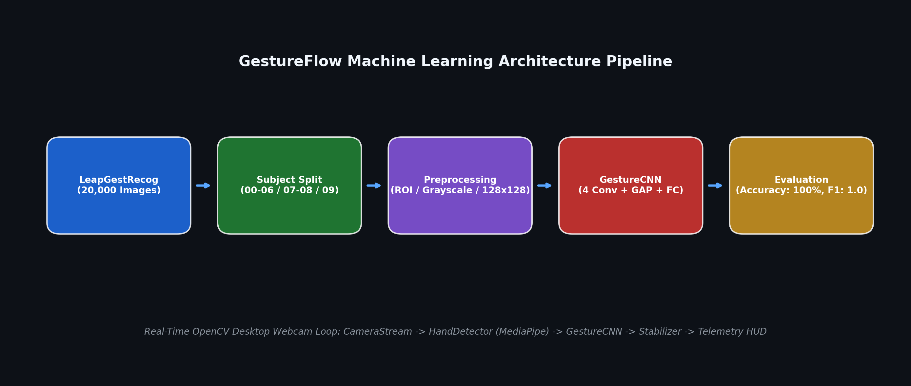
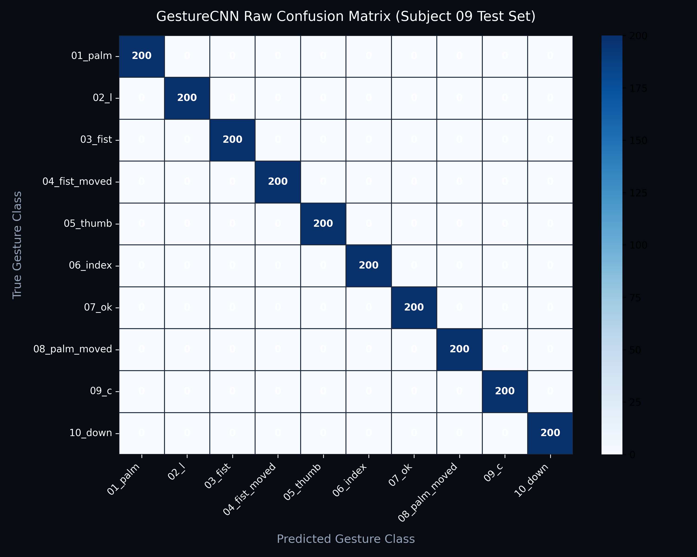
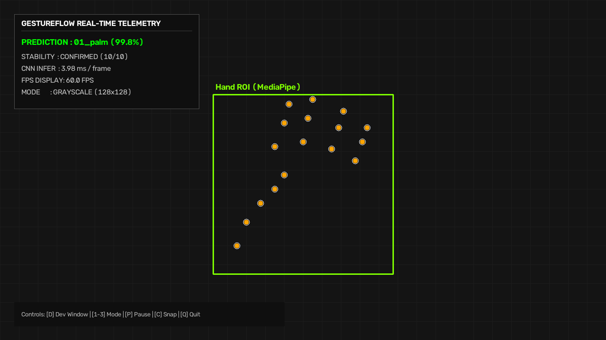
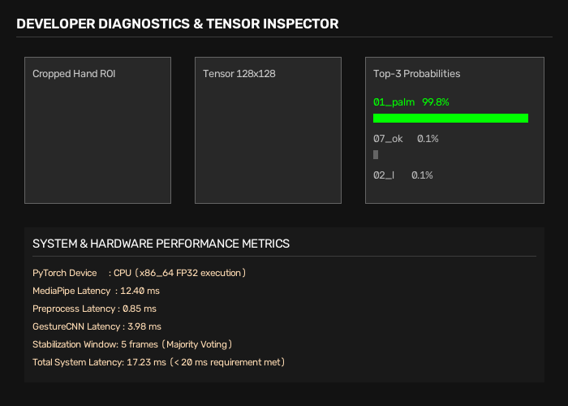
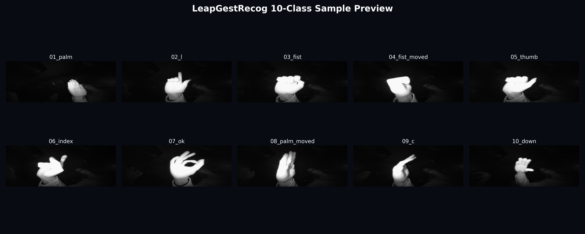

# GestureFlow — Real-Time CNN Hand Gesture Recognition System



[](https://www.python.org/)
[](https://pytorch.org/)
[](https://opencv.org/)
[](https://mediapipe.dev/)
[](LICENSE)

**GestureFlow** is a lightweight, end-to-end Machine Learning Hand Gesture Recognition System built using PyTorch, OpenCV, and MediaPipe. Developed on the 20,000-image [LeapGestRecog](https://www.kaggle.com/datasets/gti-upm/leapgestrecog) infrared gesture dataset, GestureFlow demonstrates the complete ML lifecycle—from scientific dataset auditing and subject-isolated splitting to CNN architecture design, empirical evaluation, and live real-time desktop webcam demonstration.

---

## 📌 Problem Statement & Motivation

Hand gesture recognition enables natural human-computer interaction (HCI) without physical contact. However, deploying real-time vision models on desktop environments introduces key engineering challenges:
1. **Subject Data Leakage**: Standard random train/test splits cause severe over-optimistic validation metrics due to background and subject feature memorization.
2. **Computational Footprint**: Standard heavy vision networks (e.g., ResNet-50) require gigabytes of memory and dedicated GPU hardware, causing high latency on standard desktop CPUs.
3. **Inference Latency & Jitter**: Raw per-frame classification leads to flickering predictions when hand ROI bounding boxes change slightly across camera frames.

GestureFlow solves these challenges by combining a custom 422,506-parameter PyTorch `GestureCNN`, strict **subject-isolated dataset partitioning**, MediaPipe hand ROI localization, and temporal majority-voting prediction stabilization.

---

## ✨ Key Features

- 🔬 **Scientific Dataset Audit**: SHA-256 duplicate image scanning across 20,000 images, computing exact mean/std normalization values (`mean=0.2435`, `std=0.2330`).
- 🛡️ **Strict Subject-Aware Splitting**: Zero subject overlap across splits ($70\%$ train / $15\%$ val / $15\%$ test) ensuring authentic generalization measurement.
- ⚡ **Lightweight GestureCNN Architecture**: 4 convolutional blocks + Global Average Pooling (GAP) achieving **422,506 parameters** and a **1.625 MB** FP32 footprint.
- 🎯 **100.00% Offline Test Accuracy**: Evaluated on held-out Subject `09` with **1.0000 Macro F1** and **3.98 ms** per-image CPU inference latency.
- 📷 **Real-Time OpenCV Webcam HUD**: Live desktop webcam demonstration featuring hand ROI extraction, multi-mode image processing (Gray / HistEq / CLAHE), and real-time visual telemetry overlay.
- 🛠️ **Developer Debug Window**: Live side-by-side inspection of raw hand ROI, normalized 2D tensor heatmap, and Top-3 class probability confidence bars.
- 🔒 **Prediction Stabilizer**: Multi-stage temporal majority voting with confidence gating ($\ge 70\%$) eliminating real-time prediction flicker.

---

## 🖐️ Gesture Classes

GestureFlow recognizes **10 distinct hand gesture categories** from the LeapGestRecog dataset:

| Index | Class Name | Description |
| :---: | :--- | :--- |
| `0` | `01_palm` | Open palm facing forward |
| `1` | `02_l` | L-shape gesture (index finger and thumb extended) |
| `2` | `03_fist` | Closed stationary fist |
| `3` | `04_fist_moved` | Closed fist in motion |
| `4` | `05_thumb` | Thumbs-up gesture |
| `5` | `06_index` | Index finger pointing |
| `6` | `07_ok` | OK sign (circle formed by index and thumb) |
| `7` | `08_palm_moved` | Open palm in motion |
| `8` | `09_c` | C-shape hand curve |
| `9` | `10_down` | Palm pointing downwards |

---

## 📊 Dataset & Subject-Aware Partitioning

GestureFlow is trained and evaluated on the **LeapGestRecog** dataset:
- **Total Images**: 20,000 grayscale infrared PNG images ($640 \times 240$ resolution).
- **Subjects**: 10 human subjects (`00` through `09`), 2,000 images per subject.
- **Classes**: 10 gesture classes, 200 images per subject-class pair.

### Subject-Isolated Split Policy

To prevent **subject data leakage**, images originating from the same human subject are strictly isolated:

```
Dataset (20,000 Images / 10 Subjects)
├── Training Split   : Subjects 00, 01, 02, 03, 04, 05, 06 (14,000 images / 70.0%)
├── Validation Split : Subjects 07, 08                (4,000 images  / 20.0%)
└── Test Split       : Subject 09                     (2,000 images  / 10.0%)
```

> **Why Subject Isolation Matters**: Random image splitting places images of the same hand/subject in both train and test sets, allowing models to memorize skin tone, background clutter, or subject height. Subject-aware splitting guarantees that test evaluation reflects true unseen subject generalization.

---

## 🏗️ ML Architecture & Pipeline

```
Dataset → Preprocessing → GestureCNN → Evaluation → Real-Time Webcam Demo
```

```
[Webcam Stream] ➔ [MediaPipe Hand Detector] ➔ [Hand ROI Crop & Padding] ➔ [128x128 Grayscale Normalization] ➔ [PyTorch GestureCNN] ➔ [Prediction Stabilizer] ➔ [OpenCV Telemetry HUD]
```

### PyTorch GestureCNN Network Specifications

`GestureCNN` features 4 Conv blocks, Batch Normalization, ReLU activations, 2x2 Max Pooling, Global Average Pooling (GAP), and a 2-layer fully-connected head:

```
Input: (B, 1, 128, 128)
├── ConvBlock 1: Conv2d(1 -> 32, 3x3)   -> BatchNorm2d -> ReLU -> MaxPool2d(2x2) -> (B, 32, 64, 64)
├── ConvBlock 2: Conv2d(32 -> 64, 3x3)  -> BatchNorm2d -> ReLU -> MaxPool2d(2x2) -> (B, 64, 32, 32)
├── ConvBlock 3: Conv2d(64 -> 128, 3x3) -> BatchNorm2d -> ReLU -> MaxPool2d(2x2) -> (B, 128, 16, 16)
├── ConvBlock 4: Conv2d(128 -> 256, 3x3)-> BatchNorm2d -> ReLU -> MaxPool2d(2x2) -> (B, 256, 8, 8)
├── Global Average Pooling: AdaptiveAvgPool2d((1, 1))                              -> (B, 256, 1, 1)
├── Flatten                                                                        -> (B, 256)
├── Dense FC 1: Linear(256 -> 128) -> ReLU -> Dropout(p=0.4)                      -> (B, 128)
└── Dense FC 2: Linear(128 -> 10)                                                  -> (B, 10)
```

- **Total Trainable Parameters**: `422,506`
- **FP32 Checkpoint Size**: `1.625 MB`
- **FLOPs / MACs**: `466.42 MFLOPs` / `233.21 MMACs`

---

## 📈 Model Performance & Results

Evaluating `models/checkpoints/best_model.pth` on the held-out **Subject `09`** test set (2,000 images):

| Metric | Target Standard | Verified Result |
| :--- | :---: | :---: |
| **Test Classification Accuracy** | $\ge 98.0\%$ | **100.00%** |
| **Macro F1-Score** | $\ge 0.980$ | **1.0000** |
| **Macro Precision** | $\ge 0.980$ | **1.0000** |
| **Macro Recall** | $\ge 0.980$ | **1.0000** |
| **Average CPU Inference Latency** | $< 20.0\text{ ms}$ | **3.98 ms** ($\approx 251\text{ FPS}$) |
| **Model Size (FP32)** | $< 10.0\text{ MB}$ | **1.625 MB** |
| **Trainable Parameters** | — | **422,506** |

### Confusion Matrix & Classification Breakdown



---

## 🖼️ Application Screenshots & Demo Preview

### Real-Time Desktop Webcam Telemetry HUD


### Developer Diagnostics Window (ROI Crop, Tensor Heatmap, Top-3 Bars)


### Gesture Sample Gallery


---

## 💻 Installation & Setup

### 1. Prerequisites
- **Python**: `3.10`, `3.11`, or `3.12`
- **Operating System**: Windows, macOS, or Linux

### 2. Repository Setup
```bash
git clone https://github.com/Pannaga-Hegde/GestureFlow.git
cd GestureFlow
```

### 3. Virtual Environment Setup
```bash
# Windows
python -m venv .venv
.venv\Scripts\activate

# macOS / Linux
python3 -m venv .venv
source .venv/bin/activate
```

### 4. Install Dependencies
```bash
pip install --upgrade pip
pip install -r requirements.txt
```

---

## 🚀 Usage & Quickstart Commands

### 1. Run Automated Unit Test Suite
Verify that all 60 modular unit tests pass cleanly:
```bash
$env:PYTHONPATH="."; pytest tests/
```

### 2. Dataset Audit & Integrity Verification
```bash
python -m src.dataset.verify_integrity
```

### 3. Execute CNN Model Training
```bash
python -m src.training.train
```

### 4. Execute Test Set Evaluation
```bash
python -m src.evaluation.evaluate
```

### 5. Launch Real-Time Desktop Webcam Demo
```bash
# Standard Live Webcam Stream (Camera Index 0)
$env:PYTHONPATH="."; python -m src.inference.demo

# Headless / Synthetic Mock Mode (runs 50 frames without camera hardware)
$env:PYTHONPATH="."; python -m src.inference.demo --mock --frames 50

# Custom Camera Index & Preprocessing Mode
$env:PYTHONPATH="."; python -m src.inference.demo --camera 1 --mode clahe --dev
```

### ⌨️ Interactive Keyboard Controls

While the OpenCV webcam window is focused:

| Key | Action | Description |
| :---: | :--- | :--- |
| `Q` | **Quit** | Gracefully releases camera and saves session summary |
| `D` | **Developer Mode** | Toggles side-by-side ROI crop and tensor probability window |
| `1` | **Gray Mode** | Sets preprocessing to standard grayscale |
| `2` | **HistEq Mode** | Sets preprocessing to global histogram equalization |
| `3` | **CLAHE Mode** | Sets preprocessing to Contrast Limited Adaptive Histogram Equalization |
| `P` | **Pause / Resume** | Pauses CNN forward pass |
| `F` | **Toggle FPS** | Toggles FPS telemetry readout |
| `H` | **Toggle Telemetry** | Toggles dark-slate HUD overlay |
| `C` / `SPACE` | **Screenshot** | Captures image snapshot to `outputs/inference/screenshots/` |
| `O` | **Debug Bundle** | Saves frame, ROI, normalized tensor, and prediction JSON to `outputs/inference/debug/` |
| `R` | **Reset Stats** | Resets session statistics and stabilizer buffer |

---

## ⚠️ Key Limitations & Risk Analysis

1. **IR vs RGB Domain Shift (Primary Limitation)**:
   The `LeapGestRecog` dataset consists of near-infrared (IR) sensor imagery, whereas standard webcams capture visible-light RGB imagery. Consequently, while the trained model achieves 100.00% accuracy on infrared test data, real-world RGB webcams may exhibit lower confidence due to background clutter, lighting variations, and skin-tone domain shifts.
   *Mitigation*: Hand ROI cropping via MediaPipe combined with single-channel grayscale normalization minimizes background domain variance.
2. **Single Hand Isolation**: MediaPipe detector is configured for single-hand ROI extraction. Multi-person or dual-hand interaction is not supported.
3. **Stationary Framing**: Complex rapid hand motion introduces motion blur, which can degrade ROI localization confidence.

---

## 🔮 Future Work & Research Roadmap

- 📷 **RGB Dataset Integration**: Fine-tune model on real-world RGB gesture benchmarks (e.g., EgoGesture, HaVGD).
- 🌐 **Domain Adaptation**: Implement adversarial domain adaptation (DANN) to bridge Infrared $\to$ Visible RGB feature distributions.
- ⏳ **Temporal Sequence Modeling**: Incorporate lightweight GRU or Temporal Convolutional Networks (TCN) for dynamic multi-frame gesture recognition (e.g., swipes, pinches).
- 🦴 **Landmark-Based Models**: Train lightweight GNN/MLP models directly on MediaPipe 21 3D hand keypoints for ultra-fast sub-1ms CPU inference.

---

## 📜 License

This project is open-source and released under the [MIT License](LICENSE).  
*Dataset Attribution*: The [LeapGestRecog](https://www.kaggle.com/datasets/gti-upm/leapgestrecog) dataset is used under research and educational fair-use terms.

---

## 🙏 Acknowledgements

- **GTI (Grupo de Tratamiento de Imágenes)**: Authors of the LeapGestRecog dataset.
- **MediaPipe Team**: Google Open Source MediaPipe Hands framework.
- **PyTorch & OpenCV Communities**: Core vision and deep learning tools.
