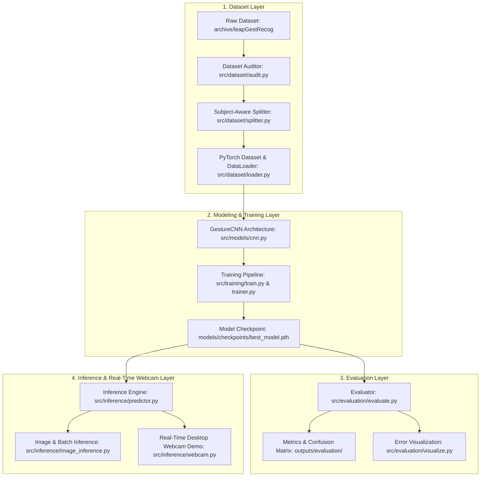

# Technical Architecture — GestureFlow

## System Architecture Overview

GestureFlow is engineered as an end-to-end Machine Learning project structured around a clean, modular Python codebase. It implements the complete ML engineering workflow—from scientific dataset auditing to CNN model development, evaluation, and local real-time desktop webcam inference.

---

## Machine Learning Lifecycle & Pipeline Architecture



---

## Repository Directory Structure

```
GestureFlow/
├── archive/                    # Raw dataset directory (leapGestRecog/ 00..09)
├── docs/                       # Single Source of Truth Documentation
│   ├── prd.md
│   ├── architecture.md
│   ├── phases.md
│   ├── rules.md
│   ├── design.md
│   ├── dataset.md
│   ├── memory.md
│   ├── roadmap.md
│   ├── changelog.md
│   ├── decisions.md
│   └── AGENTS.md
├── models/                     # Model artifacts
│   └── checkpoints/            # Saved PyTorch checkpoint weights (best_model.pth)
├── outputs/                    # Generated audit, training, evaluation & inference artifacts
│   ├── dataset/                # Dataset audit reports, stats JSON, and EDA plots
│   ├── training/               # Training history JSON, loss/accuracy curves, model summary
│   ├── evaluation/             # Classification report, confusion matrix, error grids
│   └── inference/              # Sample inference overlay outputs and benchmarks
├── src/                        # Python Source Code Root
│   ├── config/                 # Hyperparameters & path configurations
│   ├── dataset/                # Dataset audit, loader, splitter & transforms
│   │   ├── audit.py
│   │   ├── loader.py
│   │   ├── splitter.py
│   │   └── transforms.py
│   ├── models/                 # Neural network architecture definitions
│   │   └── cnn.py
│   ├── training/               # Training execution, trainer loop, callbacks
│   │   ├── train.py
│   │   ├── trainer.py
│   │   └── callbacks.py
│   ├── evaluation/             # Model evaluation, metric calculations, visualizer
│   │   ├── evaluate.py
│   │   ├── metrics.py
│   │   └── visualize.py
│   ├── inference/              # Local inference & live desktop webcam prediction engine
│   │   ├── predictor.py
│   │   ├── image_inference.py
│   │   └── webcam.py
│   └── utils/                  # Logging & helper utilities
├── tests/                      # Automated Test Suite
│   ├── unit/                   # Unit tests for dataset, models, trainer, evaluation
│   └── test_data/              # Mock dataset samples for fast test execution
├── requirements.txt            # Python dependencies manifest
└── README.md                   # Project overview & execution guide
```

---

## Component Architecture Specifications

### 1. Dataset Package (`src/dataset/`)
- `audit.py`: `DatasetAuditor` engine executing loadability, file corruption, resolution profiling, duplicate hash detection, and generating reports in `outputs/dataset/`.
- `splitter.py`: `SubjectAwareSplitter` enforcing subject-isolated partitions ($70\% / 15\% / 15\%$) across Subjects `00`–`09`.
- `transforms.py`: Preprocessing pipelines (resizing to $640\times 240$ / tensor normalization) and safe data augmentations (subtle rotation, translation, brightness adjust).
- `loader.py`: `GestureDataset` class subclassing `torch.utils.data.Dataset` and PyTorch `DataLoader` factory methods.

### 2. Models Package (`src/models/`)
- `cnn.py`: `GestureCNN` PyTorch `nn.Module` featuring 4 Convolutional blocks (Conv2d, BatchNorm2d, ReLU, MaxPool2d, Dropout) followed by Fully-Connected classification head for 10 gesture classes.

### 3. Training Package (`src/training/`)
- `callbacks.py`: Early stopping and model checkpointing callbacks.
- `trainer.py`: `ModelTrainer` class executing epoch loops, Cross-Entropy Loss computation, AdamW stepping, and learning rate scheduling.
- `train.py`: Main CLI entry point to launch model training, logging metrics and saving `models/checkpoints/best_model.pth`.

### 4. Evaluation Package (`src/evaluation/`)
- `metrics.py`: Metrics calculation module for test set accuracy, precision, recall, and macro F1-score.
- `evaluate.py`: Evaluation entry point saving classification reports and generating confusion matrices in `outputs/evaluation/`.
- `visualize.py`: Misclassified sample extractor rendering visual diagnostic grids highlighting model confusion pairs.

### 5. Inference Package (`src/inference/`)
- `predictor.py`: Core `GesturePredictor` engine loading PyTorch model checkpoints and executing single/batch tensor predictions.
- `image_inference.py`: CLI tool for running prediction on offline images or image batches.
- `webcam.py`: Real-time OpenCV desktop application capturing live webcam stream, optionally performing hand ROI detection (MediaPipe), running CNN inference, and rendering visual display overlays (Gesture Label, Confidence %, FPS, Latency).

---

## Technical Stack & Libraries

| Category | Technology | Purpose |
| :--- | :--- | :--- |
| **Core Language** | Python 3.10+ | Primary software engineering language |
| **Deep Learning** | PyTorch 2.x, Torchvision | Model definition, autograd, optimizer, CUDA/CPU execution |
| **Computer Vision**| OpenCV (`cv2`), PIL (Pillow) | Image loading, video frame capture, OpenCV visual overlays |
| **Hand Detection** | MediaPipe (Optional) | Hand ROI localization only (classification by CNN) |
| **Data Analysis** | NumPy, Pandas, Scikit-Learn | Tensor operations, metric calculations, confusion matrices |
| **Plotting & EDA** | Matplotlib, Seaborn | Distribution plots, training curves, heatmaps |
| **Testing & Quality**| Pytest, Flake8, Black | Unit testing, code formatting, linting |
