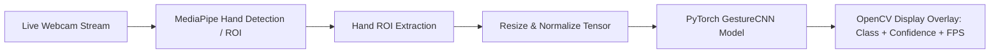

# Product Requirements Document (PRD) — GestureFlow

## Project Vision & Definition

> **GestureFlow is a CNN-based Hand Gesture Recognition System developed as a machine learning project using the LeapGestRecog dataset. The project demonstrates the complete machine learning workflow, culminating in a real-time desktop webcam application that performs live gesture recognition using the trained CNN model.**

GestureFlow is engineered as an end-to-end Machine Learning internship project. It is **not** a web application, production web service, or cloud deployment platform.

---

## Core Machine Learning Lifecycle Workflow

```mermaid
flowchart LR
    Res[1. Dataset Research] --> Aud[2. Dataset Audit]
    Aud --> Pre[3. Preprocessing]
    Pre --> Split[4. Subject Split]
    Split --> CNN[5. CNN Development]
    CNN --> Train[6. Training]
    Train --> Eval[7. Evaluation]
    Eval --> Sel[8. Model Selection]
    Sel --> Infer[9. Real-Time Inference]
    Infer --> Doc[10. Documentation]
```

---

## Scope & Core Focus Areas

1. **Dataset Audit & Preprocessing**: Scientific integrity verification, duplicate detection, image statistics generation, and data loadability validation on `archive/leapGestRecog/`.
2. **Subject-Aware Dataset Splitting**: Mandatory subject-isolated partitioning ($70\% / 15\% / 15\%$) across Subjects `00`–`09` to prevent subject data leakage.
3. **CNN Architecture & PyTorch Training**: Custom `GestureCNN` network definition, training pipeline with Cross-Entropy Loss, AdamW optimizer, Early Stopping, and checkpoint saving to `models/checkpoints/best_model.pth`.
4. **Model Evaluation & Error Analysis**: Test set evaluation on Subject `09`, producing classification reports, macro F1-score, $10 \times 10$ confusion matrix, and misclassification error analysis.
5. **Real-Time Desktop Webcam Inference**: Standalone Python desktop application capturing live webcam frames, extracting hand ROI (optionally via MediaPipe), feeding normalized frames to the trained PyTorch CNN, and displaying real-time prediction overlays with confidence score, FPS counter, and inference latency.
6. **Documentation & Repository Finalization**: Comprehensive project report, reproducible quickstart README, installation guide, benchmark tables, and visual result plots.

---

## Real-Time Desktop Webcam Inference Pipeline

> [!IMPORTANT]
> **MediaPipe Usage Boundary**: MediaPipe may be used **only** for hand localization (ROI extraction). All hand gesture classification **must always be executed exclusively by the trained PyTorch CNN model**.

---

## Key Performance & Success Metrics

| Metric | Target Standard | Measurement Context |
| :--- | :--- | :--- |
| **Offline Test Accuracy** | $\ge 98.0\%$ | Test set evaluation on subject-isolated split (Subject `09`) |
| **Macro F1-Score** | $\ge 0.98$ | Unweighted average F1-score across all 10 gesture classes |
| **Inference Latency** | $< 20\text{ ms}$ | Per-frame CPU prediction time |
| **Real-Time Frame Rate** | $\ge 30\text{ FPS}$ | Desktop webcam live inference display loop |
| **Code Reproducibility** | $100\%$ reproducible | Fixed random seeds (`seed=42`) across Python, NumPy, PyTorch |

---

## Out-of-Scope & Removed Infrastructure (Future Work)

The following components are explicitly **out of scope** for the current project:
- No web servers (FastAPI / Flask).
- No web protocols (REST APIs / WebSockets).
- No frontend web frameworks (React, Vite, TailwindCSS, HTML/CSS dashboards).
- No containerization or cloud deployment (Docker, Kubernetes, AWS/GCP).
- No browser compatibility layers.

These items belong under **Future Work** post-internship.

---

## Mandatory Engineering Rules

### Subject-Aware Dataset Splitting Rule
> [!CAUTION]
> **Strict Prohibition**: Random image-level splitting across train, validation, and test sets is **permanently prohibited**.
> All images originating from a subject folder (`00` through `09`) must belong exclusively to a single split (e.g. Subjects `00`–`06` for training, `07`–`08` for validation, `09` for testing).
