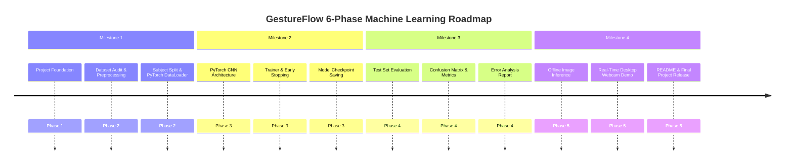
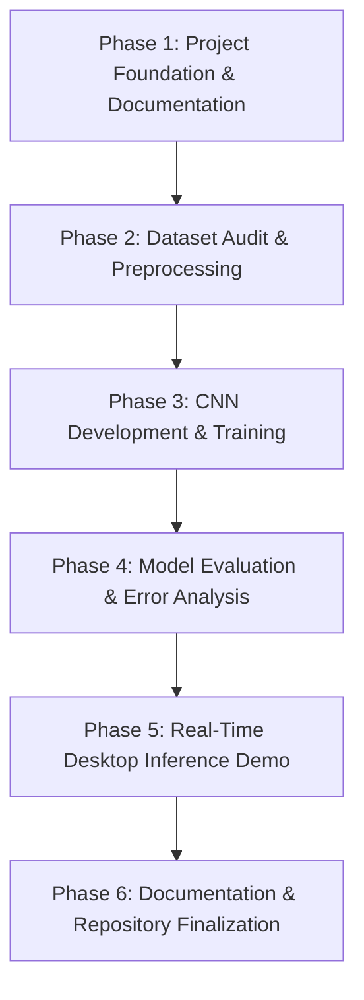

# Product Roadmap — GestureFlow

This document presents the Machine Learning project roadmap for GestureFlow.

---

---

## 6-Phase Technical Sequence

---

## Milestone Deliverables

### Milestone 1: Project Foundation & Dataset Preprocessing (Phases 1 & 2)
- Complete single-source-of-truth documentation (`docs/`).
- Automated Dataset Audit (`src/dataset/audit.py`) and EDA outputs (`outputs/dataset/`).
- Enforced subject-aware splitter ($70\% / 15\% / 15\%$) isolating subjects `00`–`06` (Train), `07`–`08` (Val), and `09` (Test).
- PyTorch `GestureDataset` and `DataLoader` implementation with safe data augmentations.

### Milestone 2: Model Architecture & PyTorch Training (Phase 3)
- PyTorch Convolutional Neural Network (`GestureCNN`).
- Configurable trainer loop with AdamW optimizer, Cross-Entropy Loss, and Early Stopping.
- Saved best model checkpoint (`models/checkpoints/best_model.pth`).
- Training history logs and loss/accuracy curves (`outputs/training/training_curves.png`).

### Milestone 3: Evaluation & Error Analysis (Phase 4)
- Quantitative test set evaluation outputting classification report and macro F1-score ($\ge 0.98$).
- $10 \times 10$ confusion matrix heatmap and misclassified sample diagnostic grid (`outputs/evaluation/`).
- Comprehensive error analysis report published in `outputs/evaluation/error_analysis_report.md`.

### Milestone 4: Real-Time Inference Demo & Project Finalization (Phases 5 & 6)
- Standalone inference engine (`src/inference/predictor.py`) for single-image and batch predictions.
- Real-time desktop webcam demonstration application (`src/inference/webcam.py`) rendering live gesture overlay, confidence %, FPS counter, and latency metrics.
- MediaPipe utilized strictly for optional hand ROI localization; classification performed exclusively by PyTorch CNN.
- Comprehensive `README.md` containing project overview, quickstart setup, benchmark tables, and embedded result plots.
